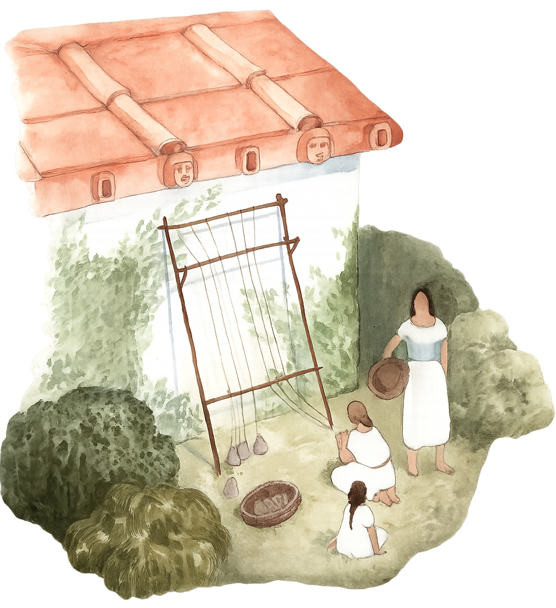

<a id="readme-top"></a>

[![Contributors][contributors-shield]][contributors-url]
[![Forks][forks-shield]][forks-url]
[![Stargazers][stars-shield]][stars-url]
[![Issues][issues-shield]][issues-url]
[![MIT][license-shield]][license-url]
[![LinkedIn][linkedin-shield]][linkedin-url]


<!-- PROJECT LOGO -->
<br />
<div align="center">
  <a href="https://github.com/CalebUmass/static-web-showing">
    
  </a>

<h3 align="center">static-web-showing</h3>

  <p align="center">
    This website serves as a central hub for showcasing digital projects created by the 2025 Poggio Civitate archaeological field school.
    <br />
    <a href="https://github.com/CalebUmass/static-web-showing"><strong>Explore the docs »</strong></a>
    <br />
    <br />
    <a href="https://github.com/CalebUmass/static-web-showing">View Demo</a>
    &middot;
    <a href="https://github.com/CalebUmass/static-web-showing/issues/new?labels=bug&template=bug-report---.md">Report Bug</a>
    &middot;
    <a href="https://github.com/CalebUmass/static-web-showing/issues/new?labels=enhancement&template=feature-request---.md">Request Feature</a>
  </p>
</div>


<!-- TABLE OF CONTENTS -->
<details>
  <summary>Table of Contents</summary>
  <ol>
    <li>
      <a href="#about-the-project">About The Project</a>
      <ul>
        <li><a href="#built-with">Built With</a></li>
      </ul>
    </li>
    <li>
      <a href="#getting-started">Getting Started</a>
      <ul>
        <li><a href="#prerequisites">Prerequisites</a></li>
        <li><a href="#installation">Installation</a></li>
      </ul>
    </li>
    <li><a href="#usage">Usage</a></li>
    <li><a href="#contributing">Contributing</a></li>
    <li><a href="#license">License</a></li>
    <li><a href="#contact">Contact</a></li>
    <li><a href="#acknowledgments">Acknowledgments</a></li>
  </ol>
</details>


<!-- ABOUT THE PROJECT -->
## About The Project

[![Sceenshot of product home][product-screenshot]](https://poggiocivitate.net)

<p align="right">(<a href="#readme-top">back to top</a>)</p>


### Built With

* 
* 
* 
* 

<p align="right">(<a href="#readme-top">back to top</a>)</p>


<!-- GETTING STARTED -->
## Getting Started

To add a project to this webpage or make edits follow these steps.

### Prerequisites

First, to work with this project, ensure you have the following installed:

* **npm**
  ```sh
  npm install npm@latest -g
  ```

* **Git**  
  https://git-scm.com/downloads

* **VS Code**  
  https://code.visualstudio.com/

* **SSH access to AWS Lightsail**
  - You'll need your `.pem` key file (usually downloaded when setting up Lightsail - need it to access the server)
  - Know your public IP address (e.g. `34.212.XXX.XXX`)

---

### Installation

1. **Clone the repo**
   ```sh
   git clone https://github.com/CalebUmass/static-web-showing.git
   cd static-web-showing
   ```

2. **Open the project in VS Code**
   ```sh
   code .
   ```

3. **Install NPM packages**
   ```sh
   npm install
   ```

4. **Make edits**
   - To add a new project:  
     Place your project folder (e.g. `my-project`) in the appropriate subdirectory like `/static-web-showing/`.
     Navigate to the README.md inside `/Projects-Landing-Page-main-copy` for information on how to set up file paths + webpage movement
   - To change the HTML:  
     Edit either HTML + CSS files inside the `/Projects-Landing-Page-main-copy` folder using VS Code.

5. **Push your/the changes to GitHub**
   ```sh
   git add .
   git commit -m "Add new project / update HTML"
   git push origin main
   ```

---

### Deploying to AWS Lightsail Apache Server

1. **SSH into your/the Lightsail server**
   ```sh
   ssh -i ~/path/to/LightsailDefaultKey.pem bitnami@<YOUR_PUBLIC_IP>
   ```

2. **Navigate to the Apache server directory**
   ```sh
   cd /opt/bitnami/apache2/htdocs/static-web-showing
   ```

3. **Pull the latest changes from GitHub**
   If you’ve already cloned the repo on the server:
   ```sh
   git pull origin main
   ```

   If not yet cloned:
   ```sh
   git clone https://github.com/CalebUmass/static-web-showing.git
   ```

4. **(Optional) Restart Apache (if needed)**
   ```sh
   sudo /opt/bitnami/ctlscript.sh restart apache
   ```

   Your updated site should now be live at:

```
http://<YOUR_PUBLIC_IP>/static-web-showing/
```

Or, if you’ve set up HTTPS and a domain:

```
https://poggiocivitate.net
```

---

<p align="right">(<a href="#readme-top">back to top</a>)</p>


<!-- USAGE EXAMPLES -->
## Usage

Use this space to show useful examples of how a project can be used. Additional screenshots, code examples and demos work well in this space. You may also link to more resources.

- [CalebUmass/prototype1](https://github.com/CalebUmass/prototype1)
- [maliegeery/Projects-Landing-Page](https://github.com/maliegeery/Projects-Landing-Page)
- [ai-meii/](https://github.com/ai-meii)

<p align="right">(<a href="#readme-top">back to top</a>)</p>


<!-- CONTRIBUTING -->
## Contributing

Contributions are what make projects like this possible! Any contributions you make are **greatly appreciated**.

If you have a suggestion that would make this better, please fork the repo and create a pull request. You can also simply open an issue with the tag "enhancement".
Don't forget to give the project a star! Thanks again!

1. Fork the Project
2. Create your Feature Branch (`git checkout -b feature/AmazingFeature`)
3. Commit your Changes (`git commit -m 'Add some AmazingFeature'`)
4. Push to the Branch (`git push origin feature/AmazingFeature`)
5. Open a Pull Request

<p align="right">(<a href="#readme-top">back to top</a>)</p>

### Top contributors:

<a href="https://github.com/CalebUmass/static-web-showing/graphs/contributors">
  
</a>


<!-- LICENSE -->
## License

Distributed under the MIT. See `LICENSE.txt` for more information.

<p align="right">(<a href="#readme-top">back to top</a>)</p>


<!-- CONTACT -->
## Contact

**Cole Reilly**
[LinkedIn](https://www.linkedin.com/in/cole-adam-reilly-61b43b162) - careilly@umass.edu

**Caleb Richards**  
[LinkedIn](https://www.linkedin.com/in/caleb-richards-aab742375) – carichards@umass.edu

**Ai Mei**  
[LinkedIn](https://www.linkedin.com/in/ai-mei-zhang-227429244) – aimeiazhang@umass.edu

**Malie Geery**  
[LinkedIn](https://www.linkedin.com/in/malie-geery-3b8202311) – mgeery@umass.edu

Project Link: [https://github.com/CalebUmass/static-web-showing](https://github.com/CalebUmass/static-web-showing)

<p align="right">(<a href="#readme-top">back to top</a>)</p>


<!-- MARKDOWN LINKS & IMAGES -->
<!-- https://www.markdownguide.org/basic-syntax/#reference-style-links -->
[contributors-shield]: https://img.shields.io/github/contributors/CalebUmass/static-web-showing.svg?style=for-the-badge
[contributors-url]: https://github.com/CalebUmass/static-web-showing/graphs/contributors
[forks-shield]: https://img.shields.io/github/forks/CalebUmass/static-web-showing.svg?style=for-the-badge
[forks-url]: https://github.com/CalebUmass/static-web-showing/network/members
[stars-shield]: https://img.shields.io/github/stars/CalebUmass/static-web-showing.svg?style=for-the-badge
[stars-url]: https://github.com/CalebUmass/static-web-showing/stargazers
[issues-shield]: https://img.shields.io/github/issues/CalebUmass/static-web-showing.svg?style=for-the-badge
[issues-url]: https://github.com/CalebUmass/static-web-showing/issues
[license-shield]: https://img.shields.io/github/license/CalebUmass/static-web-showing.svg?style=for-the-badge
[license-url]: https://github.com/CalebUmass/static-web-showing/blob/master/LICENSE.txt
[linkedin-shield]: https://img.shields.io/badge/-LinkedIn-black.svg?style=for-the-badge&logo=linkedin&colorB=555
[linkedin-url]: https://linkedin.com/in/caleb-richards-aab742375
[product-screenshot]: images/product-screenshot.png
[Next.js]: https://img.shields.io/badge/next.js-000000?style=for-the-badge&logo=nextdotjs&logoColor=white
[Next-url]: https://nextjs.org/
[React.js]: https://img.shields.io/badge/React-20232A?style=for-the-badge&logo=react&logoColor=61DAFB
[React-url]: https://reactjs.org/
[Vue.js]: https://img.shields.io/badge/Vue.js-35495E?style=for-the-badge&logo=vuedotjs&logoColor=4FC08D
[Vue-url]: https://vuejs.org/
[Angular.io]: https://img.shields.io/badge/Angular-DD0031?style=for-the-badge&logo=angular&logoColor=white
[Angular-url]: https://angular.io/
[Svelte.dev]: https://img.shields.io/badge/Svelte-4A4A55?style=for-the-badge&logo=svelte&logoColor=FF3E00
[Svelte-url]: https://svelte.dev/
[Laravel.com]: https://img.shields.io/badge/Laravel-FF2D20?style=for-the-badge&logo=laravel&logoColor=white
[Laravel-url]: https://laravel.com
[Bootstrap.com]: https://img.shields.io/badge/Bootstrap-563D7C?style=for-the-badge&logo=bootstrap&logoColor=white
[Bootstrap-url]: https://getbootstrap.com
[JQuery.com]: https://img.shields.io/badge/jQuery-0769AD?style=for-the-badge&logo=jquery&logoColor=white
<<<<<<< HEAD
[JQuery-url]: https://jquery.com 
=======
[JQuery-url]: https://jquery.com 
>>>>>>> 00aad70acd459c3920604b0840e8987c54a38441
