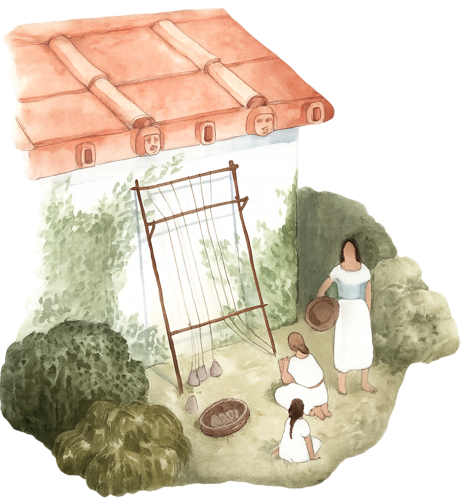

<a id="readme-top"></a>

[![Contributors][contributors-shield]][contributors-url]
[![Forks][forks-shield]][forks-url]
[![Stargazers][stars-shield]][stars-url]
[![Issues][issues-shield]][issues-url]
[![MIT][license-shield]][license-url]
[![LinkedIn][linkedin-shield]][linkedin-url]


<!-- PROJECT LOGO -->
<br />
<div align="center">
  <a href="https://github.com/CalebUmass/static-web-showing">
    
  </a>

<h3 align="center">static-web-showing</h3>

  <p align="center">
    This website serves as a central hub for showcasing digital projects created by the 2025 Poggio Civitate archaeological field school.
    <br />
    <a href="https://github.com/CalebUmass/static-web-showing" target="_blank"><strong>Explore the docs »</strong></a>
    <br />
    <br />
    <a href="https://poggiocivitate.net" target="_blank">View Demo</a>
    &middot;
    <a href="https://github.com/CalebUmass/static-web-showing/issues/new?labels=bug&template=bug-report---.md" target="_blank">Report Bug</a>
    &middot;
    <a href="https://github.com/CalebUmass/static-web-showing/issues/new?labels=enhancement&template=feature-request---.md" target="_blank">Request Feature</a>
  </p>
</div>


<!-- TABLE OF CONTENTS -->
<details>
  <summary>Table of Contents</summary>
  <ol>
    <li>
      <a href="#about-the-project">About The Project</a>
      <ul>
        <li><a href="#built-with">Built With</a></li>
        <li><a href="#project-structure">Project Structure</a></li>
      </ul>
    </li>
    <li>
      <a href="#getting-started">Getting Started</a>
      <ul>
        <li><a href="#prerequisites">Prerequisites</a></li>
        <li><a href="#installation">Installation</a></li>
        <li><a href="#deploying-to-the-server">Deploying to the Server</a></li>
      </ul>
    </li>
    <li><a href="#usage">Usage</a></li>
    <li><a href="#contributing">Contributing</a></li>
    <li><a href="#license">License</a></li>
    <li><a href="#contact">Contact</a></li>
    <li><a href="#acknowledgments">Acknowledgments</a></li>
  </ol>
</details>


<!-- ABOUT THE PROJECT -->
## About The Project

[![Sceenshot of product home][product-screenshot]](https://poggiocivitate.net)

A central hub for digital projects from the Poggio Civitate archaeological field
school. The site is mostly static HTML, CSS, and JavaScript, with a single
NestJS backend that powers the interactive tools (the trench book reader, the
dig map photo points, and Cassetta catalog search).

It runs on an Ubuntu AWS Lightsail instance behind the system Apache web server,
with Let's Encrypt SSL via Certbot. For full server administration details
(Apache config, the API service, SSL, subdomains, maintenance) see
[SERVER.md](./SERVER.md).

<p align="right">(<a href="#readme-top">back to top</a>)</p>


### Built With

* 
* 
* 
* 
* 

<p align="right">(<a href="#readme-top">back to top</a>)</p>


<!-- PROJECT STRUCTURE -->
### Project Structure

The repo is a flat collection of project folders. On the server it is checked out
at the web root, so each folder is reachable at `poggiocivitate.net/<folder>/`.

| Folder | Description |
|---|---|
| `projects/` | Landing page (the site homepage) |
| `coords/` | Coordinate converter (static, uses proj4js) |
| `reader/` | Trench book viewer frontend |
| `map/` | MapLibre dig map, plus a basic-auth editor page |
| `mag-search/` | Cassetta catalog search frontend |
| `api/` | Unified NestJS backend serving all endpoints (port 3001) |
| and others! |

The `api/` service is proxied by Apache at `/api`. Static folders need no build
step; the `api/` project is a Node app that must be built and run as a service
(see [SERVER.md](./SERVER.md)).

<p align="right">(<a href="#readme-top">back to top</a>)</p>


<!-- GETTING STARTED -->
## Getting Started

To add a project to this webpage or make edits, follow these steps.

### Prerequisites

To work with this project, ensure the following are installed:

* **npm** (only needed when working on the `api/` backend)
  ```sh
  npm install npm@latest -g
  ```

* **Git**  
  https://git-scm.com/downloads

* **VS Code**  
  https://code.visualstudio.com/

* **SSH access to AWS Lightsail** (for deployment)
  - The `.pem` key file downloaded when the Lightsail instance was set up
  - The server's static public IP address (e.g. `34.212.XXX.XXX`)

---

### Installation

1. **Clone the repo**
   ```sh
   git clone https://github.com/CalebUmass/static-web-showing.git
   cd static-web-showing
   ```

2. **Open the project in VS Code**
   ```sh
   code .
   ```

3. **Install NPM packages** (only if working on the `api/` backend)
   ```sh
   cd api
   npm install
   ```

4. **Make edits**
   - **Add a new project:** create a new folder at the repo root (e.g.
     `my-project/`) containing at least an `index.html`. It will be served at
     `poggiocivitate.net/my-project/`. Use relative links to other projects and
     assets so they keep working under the flat structure.
   - **Edit the homepage:** the landing page lives in the `projects/` folder.
   - **Work on the backend:** the interactive endpoints live in `api/`.

5. **Push the changes to GitHub**
   ```sh
   git add .
   git commit -m "Add new project / update site"
   git push origin main
   ```

---

### Deploying to the Server

The site is served from an Ubuntu Lightsail instance running system Apache.

1. **SSH into the server** (the login user is `ubuntu`)
   ```sh
   ssh -i ~/path/to/your-key.pem ubuntu@<PUBLIC_IP>
   ```

2. **Pull the latest changes**  
   A helper script at `/home/ubuntu/pull.sh` updates the web root from GitHub:
   ```sh
   cd /home/ubuntu
   ./pull.sh
   ```
   Or manually:
   ```sh
   cd /var/www/html
   git pull
   ```

3. **If backend (`api/`) code changed**, a pull alone is not enough. The
   compiled output is what runs, so rebuild and restart the service:
   ```sh
   cd /var/www/html/api
   npm install
   npm run build
   sudo systemctl restart dig-map-api
   ```

4. **If Apache config changed**, reload it:
   ```sh
   sudo systemctl reload apache2
   ```

> Static-only changes are live as soon as they are pulled. See
> [SERVER.md](./SERVER.md) for SSL, subdomains, the API service, and
> troubleshooting.

---

<p align="right">(<a href="#readme-top">back to top</a>)</p>


<!-- USAGE EXAMPLES -->
## Usage

The live site is at [poggiocivitate.net](https://poggiocivitate.net). Related and
source repositories:

- [CalebUmass/prototype1](https://github.com/CalebUmass/prototype1)
- [maliegeery/Projects-Landing-Page](https://github.com/maliegeery/Projects-Landing-Page)
- [ai-meii/](https://github.com/ai-meii)

<p align="right">(<a href="#readme-top">back to top</a>)</p>


<!-- CONTRIBUTING -->
## Contributing

Contributions are what make projects like this possible! Any contributions you make are **greatly appreciated**.

If you have a suggestion that would make this better, please fork the repo and create a pull request. You can also simply open an issue with the tag "enhancement".
Don't forget to give the project a star! Thanks again!

1. Fork the Project
2. Create your Feature Branch (`git checkout -b feature/AmazingFeature`)
3. Commit your Changes (`git commit -m 'Add some AmazingFeature'`)
4. Push to the Branch (`git push origin feature/AmazingFeature`)
5. Open a Pull Request

<p align="right">(<a href="#readme-top">back to top</a>)</p>

### Top contributors:

<a href="https://github.com/CalebUmass/static-web-showing/graphs/contributors">
  
</a>


<!-- LICENSE -->
## License

Distributed under the MIT License. See `LICENSE.txt` for more information.

<p align="right">(<a href="#readme-top">back to top</a>)</p>


<!-- CONTACT -->
## Contact

**Cole Adam Reilly**
[LinkedIn](https://www.linkedin.com/in/cole-adam-reilly-61b43b162) - careilly@umass.edu

**Caleb Richards**  
[LinkedIn](https://www.linkedin.com/in/caleb-richards-aab742375) – carichards@umass.edu

**Ai Mei**  
[LinkedIn](https://www.linkedin.com/in/ai-mei-zhang-227429244) – aimeiazhang@umass.edu

**Malie Geery**  
[LinkedIn](https://www.linkedin.com/in/malie-geery-3b8202311) – mgeery@umass.edu

Project Link: [https://github.com/CalebUmass/static-web-showing](https://github.com/CalebUmass/static-web-showing)

<p align="right">(<a href="#readme-top">back to top</a>)</p>


<!-- ACKNOWLEDGMENTS -->
## Acknowledgments

* The Poggio Civitate Archaeological Project and its 2025/2026 field school
* [Open Context](https://opencontext.org) for archaeological data hosting
* [Best-README-Template](https://github.com/othneildrew/Best-README-Template)

<p align="right">(<a href="#readme-top">back to top</a>)</p>


<!-- MARKDOWN LINKS & IMAGES -->
<!-- https://www.markdownguide.org/basic-syntax/#reference-style-links -->
[contributors-shield]: https://img.shields.io/github/contributors/CalebUmass/static-web-showing.svg?style=for-the-badge
[contributors-url]: https://github.com/CalebUmass/static-web-showing/graphs/contributors
[forks-shield]: https://img.shields.io/github/forks/CalebUmass/static-web-showing.svg?style=for-the-badge
[forks-url]: https://github.com/CalebUmass/static-web-showing/network/members
[stars-shield]: https://img.shields.io/github/stars/CalebUmass/static-web-showing.svg?style=for-the-badge
[stars-url]: https://github.com/CalebUmass/static-web-showing/stargazers
[issues-shield]: https://img.shields.io/github/issues/CalebUmass/static-web-showing.svg?style=for-the-badge
[issues-url]: https://github.com/CalebUmass/static-web-showing/issues
[license-shield]: https://img.shields.io/github/license/CalebUmass/static-web-showing.svg?style=for-the-badge
[license-url]: https://github.com/CalebUmass/static-web-showing/blob/master/LICENSE.txt
[linkedin-shield]: https://img.shields.io/badge/-LinkedIn-black.svg?style=for-the-badge&logo=linkedin&colorB=555
[linkedin-url]: https://linkedin.com/in/caleb-richards-aab742375
[product-screenshot]: shared/images/product-screenshot.png